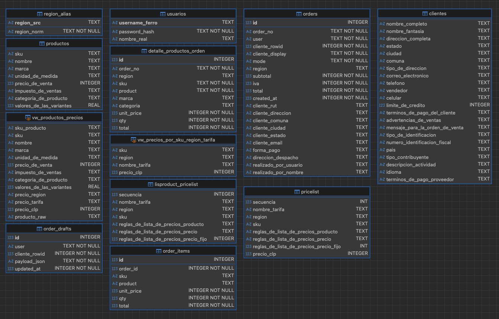

# 🗃️ Consultas SQL – TODOFERRETERO



Este es un documento sencillo, que centraliza las consultas SQL en el código de la APP.

# Consultas SQL 

_Proyecto_: TODOFERRETERO

------------------------------------------------------------------------
 ## pdf_pedido.py

**Línea 61**

```sql
        SELECT order_no, user, cliente_rowid, cliente_display, mode, region,
               subtotal, iva, total, created_at,
               cliente_rut, cliente_direccion, cliente_comuna, cliente_ciudad,
               cliente_estado, cliente_email, forma_pago, direccion_despacho,
               realizado_por_usuario, realizado_por_nombre
        FROM orders
        WHERE order_no = ?
        LIMIT 1
    
```

- Tipo: **Lectura (SELECT)**
- Tabla(s): **orders**
- Campos: order_no, user, cliente_rowid, cliente_display, mode, region, subtotal, iva, total, created_at, cliente_rut, cliente_direccion, cliente_comuna, cliente_ciudad, cliente_estado, cliente_email, forma_pago, direccion_despacho, realizado_por_usuario, realizado_por_nombre
- Filtro: `order_no = ?`
- Limita cantidad de filas con **LIMIT**.

------------------------------------------------------------------------
------------------------------------------------------------------------
 ## pdf_pedido.py

**Línea 61**

```sql
        SELECT order_no, user, cliente_rowid, cliente_display, mode, region,
               subtotal, iva, total, created_at,
               cliente_rut, cliente_direccion, cliente_comuna, cliente_ciudad,
               cliente_estado, cliente_email, forma_pago, direccion_despacho,
               realizado_por_usuario, realizado_por_nombre
        FROM orders
        WHERE order_no = ?
        LIMIT 1
    
```

- Tipo: **Lectura (SELECT)**
- Tabla(s): **orders**
- Campos: order_no, user, cliente_rowid, cliente_display, mode, region, subtotal, iva, total, created_at, cliente_rut, cliente_direccion, cliente_comuna, cliente_ciudad, cliente_estado, cliente_email, forma_pago, direccion_despacho, realizado_por_usuario, realizado_por_nombre
- Filtro: `order_no = ?`
- Limita cantidad de filas con **LIMIT**.

------------------------------------------------------------------------
------------------------------------------------------------------------
 ## pdf_pedido.py

**Línea 83**

```sql
        SELECT sku, product, marca, categoria, unit_price, qty, total
        FROM detalle_productos_orden
        WHERE order_no = ?
        ORDER BY id
    
```

- Tipo: **Lectura (SELECT)**
- Tabla(s): **detalle_productos_orden**
- Campos: sku, product, marca, categoria, unit_price, qty, total
- Filtro: `order_no = ?`
- Ordena resultados con **ORDER BY**.

------------------------------------------------------------------------
------------------------------------------------------------------------
 ## pdf_pedido.py

**Línea 83**

```sql
        SELECT sku, product, marca, categoria, unit_price, qty, total
        FROM detalle_productos_orden
        WHERE order_no = ?
        ORDER BY id
    
```

- Tipo: **Lectura (SELECT)**
- Tabla(s): **detalle_productos_orden**
- Campos: sku, product, marca, categoria, unit_price, qty, total
- Filtro: `order_no = ?`
- Ordena resultados con **ORDER BY**.

------------------------------------------------------------------------
------------------------------------------------------------------------
 ## historial.py

**Línea 156**

```sql
                    SELECT o.order_no, o.cliente_display, o.total, o.created_at
                    FROM orders o
                    WHERE o.user=?
                    ORDER BY o.id DESC
                    LIMIT 200
                
```

- Tipo: **Lectura (SELECT)**
- Tabla(s): **orders**
- Campos: o.order_no, o.cliente_display, o.total, o.created_at
- Filtro: `o.user=?`
- Ordena resultados con **ORDER BY**.
- Limita cantidad de filas con **LIMIT**.

------------------------------------------------------------------------
------------------------------------------------------------------------
 ## historial.py

**Línea 156**

```sql
                    SELECT o.order_no, o.cliente_display, o.total, o.created_at
                    FROM orders o
                    WHERE o.user=?
                    ORDER BY o.id DESC
                    LIMIT 200
                
```

- Tipo: **Lectura (SELECT)**
- Tabla(s): **orders**
- Campos: o.order_no, o.cliente_display, o.total, o.created_at
- Filtro: `o.user=?`
- Ordena resultados con **ORDER BY**.
- Limita cantidad de filas con **LIMIT**.

------------------------------------------------------------------------
------------------------------------------------------------------------
 ## historial.py

**Línea 164**

```sql
                    SELECT o.order_no, o.cliente_display, o.total, o.created_at
                    FROM orders o
                    LEFT JOIN clientes c ON c.rowid = o.cliente_rowid
                    WHERE o.user=?
                      AND (
                           o.order_no LIKE ? COLLATE NOCASE
                        OR o.cliente_display LIKE ? COLLATE NOCASE
                        OR c.nombre_fantasia LIKE ? COLLATE NOCASE
                        OR c.nombre_completo LIKE ? COLLATE NOCASE
                        OR c.numero_identificacion_fiscal LIKE ? COLLATE NOCASE
                      )
                    ORDER BY o.id DESC
                    LIMIT 200
                
```

- Tipo: **Lectura (SELECT)**
- Tabla(s): **orders, clientes**
- Campos: o.order_no, o.cliente_display, o.total, o.created_at
- Filtro: `o.user=? AND ( o.order_no LIKE ? COLLATE NOCASE OR o.cliente_display LIKE ? COLLATE NOCASE OR c.nombre_fantasia LIKE ? COLLATE NOCASE OR c.nombre_completo LIKE ? COLLATE NOCASE OR c.numero_identificacion_fiscal LIKE ? COLLATE NOCASE )`
- Ordena resultados con **ORDER BY**.
- Limita cantidad de filas con **LIMIT**.

------------------------------------------------------------------------
------------------------------------------------------------------------
 ## historial.py

**Línea 164**

```sql
                    SELECT o.order_no, o.cliente_display, o.total, o.created_at
                    FROM orders o
                    LEFT JOIN clientes c ON c.rowid = o.cliente_rowid
                    WHERE o.user=?
                      AND (
                           o.order_no LIKE ? COLLATE NOCASE
                        OR o.cliente_display LIKE ? COLLATE NOCASE
                        OR c.nombre_fantasia LIKE ? COLLATE NOCASE
                        OR c.nombre_completo LIKE ? COLLATE NOCASE
                        OR c.numero_identificacion_fiscal LIKE ? COLLATE NOCASE
                      )
                    ORDER BY o.id DESC
                    LIMIT 200
                
```

- Tipo: **Lectura (SELECT)**
- Tabla(s): **orders, clientes**
- Campos: o.order_no, o.cliente_display, o.total, o.created_at
- Filtro: `o.user=? AND ( o.order_no LIKE ? COLLATE NOCASE OR o.cliente_display LIKE ? COLLATE NOCASE OR c.nombre_fantasia LIKE ? COLLATE NOCASE OR c.nombre_completo LIKE ? COLLATE NOCASE OR c.numero_identificacion_fiscal LIKE ? COLLATE NOCASE )`
- Ordena resultados con **ORDER BY**.
- Limita cantidad de filas con **LIMIT**.

------------------------------------------------------------------------
------------------------------------------------------------------------
 ## resumen_cliente.py

**Línea 70**

```sql
SELECT 1 FROM order_drafts WHERE user=? AND cliente_rowid=? LIMIT 1
```

- Tipo: **Lectura (SELECT)**
- Tabla(s): **order_drafts**
- Campos: 1
- Filtro: `user=? AND cliente_rowid=?`
- Limita cantidad de filas con **LIMIT**.

------------------------------------------------------------------------
------------------------------------------------------------------------
 ## resumen_cliente.py

**Línea 71**

```sql
SELECT 1 FROM order_drafts WHERE user=? AND cliente_rowid=? LIMIT 1
```

- Tipo: **Lectura (SELECT)**
- Tabla(s): **order_drafts**
- Campos: 1
- Filtro: `user=? AND cliente_rowid=?`
- Limita cantidad de filas con **LIMIT**.

------------------------------------------------------------------------
------------------------------------------------------------------------
 ## resumen_cliente.py

**Línea 93**

```sql
SELECT ? FROM clientes WHERE rowid=? LIMIT 1
```

- Tipo: **Lectura (SELECT)**
- Tabla(s): **clientes**
- Campos: ?
- Filtro: `rowid=?`
- Limita cantidad de filas con **LIMIT**.

------------------------------------------------------------------------
------------------------------------------------------------------------
 ## resumen_cliente.py

**Línea 93**

```sql
SELECT 
```

- Tipo: **Lectura (SELECT)**

------------------------------------------------------------------------
------------------------------------------------------------------------
 ## resumen_cliente.py

**Línea 95**

```sql
                SELECT ?
                FROM clientes
                WHERE (LOWER(nombre_fantasia)=LOWER(?) AND ?<> '')
                   OR (LOWER(nombre_completo)=LOWER(?) AND ?<> '')
                LIMIT 1
            
```

- Tipo: **Lectura (SELECT)**
- Tabla(s): **clientes**
- Campos: ?
- Filtro: `(LOWER(nombre_fantasia)=LOWER(?) AND ?<> '') OR (LOWER(nombre_completo)=LOWER(?) AND ?<> '')`
- Limita cantidad de filas con **LIMIT**.

------------------------------------------------------------------------
------------------------------------------------------------------------
 ## resumen_cliente.py

**Línea 95**

```sql
                SELECT 
```

- Tipo: **Lectura (SELECT)**

------------------------------------------------------------------------
------------------------------------------------------------------------
 ## carrito.py

**Línea 193**

```sql
            SELECT sku, reglas_de_lista_de_precios_producto, reglas_de_lista_de_precios_precio_fijo
            FROM pricelist
            WHERE region = ?
              AND (sku LIKE ? OR reglas_de_lista_de_precios_producto LIKE ?)
            ORDER BY sku LIMIT 50
        
```

- Tipo: **Lectura (SELECT)**
- Tabla(s): **pricelist**
- Campos: sku, reglas_de_lista_de_precios_producto, reglas_de_lista_de_precios_precio_fijo
- Filtro: `region = ? AND (sku LIKE ? OR reglas_de_lista_de_precios_producto LIKE ?)`
- Ordena resultados con **ORDER BY**.
- Limita cantidad de filas con **LIMIT**.

------------------------------------------------------------------------
------------------------------------------------------------------------
 ## carrito.py

**Línea 193**

```sql
            SELECT sku, reglas_de_lista_de_precios_producto, reglas_de_lista_de_precios_precio_fijo
            FROM pricelist
            WHERE region = ?
              AND (sku LIKE ? OR reglas_de_lista_de_precios_producto LIKE ?)
            ORDER BY sku LIMIT 50
        
```

- Tipo: **Lectura (SELECT)**
- Tabla(s): **pricelist**
- Campos: sku, reglas_de_lista_de_precios_producto, reglas_de_lista_de_precios_precio_fijo
- Filtro: `region = ? AND (sku LIKE ? OR reglas_de_lista_de_precios_producto LIKE ?)`
- Ordena resultados con **ORDER BY**.
- Limita cantidad de filas con **LIMIT**.

------------------------------------------------------------------------
------------------------------------------------------------------------
 ## carrito.py

**Línea 278**

```sql
            INSERT INTO order_drafts(user, cliente_rowid, payload_json, updated_at)
            VALUES (?, ?, ?, ?)
            ON CONFLICT(user, cliente_rowid)
            DO UPDATE SET payload_json=excluded.payload_json, updated_at=excluded.updated_at
        
```

- Tipo: **Escritura (INSERT)**
- Tabla(s): **order_drafts**

------------------------------------------------------------------------
------------------------------------------------------------------------
 ## carrito.py

**Línea 278**

```sql
            INSERT INTO order_drafts(user, cliente_rowid, payload_json, updated_at)
            VALUES (?, ?, ?, ?)
            ON CONFLICT(user, cliente_rowid)
            DO UPDATE SET payload_json=excluded.payload_json, updated_at=excluded.updated_at
        
```

- Tipo: **Escritura (INSERT)**
- Tabla(s): **order_drafts**

------------------------------------------------------------------------
------------------------------------------------------------------------
 ## carrito.py

**Línea 288**

```sql
SELECT payload_json FROM order_drafts WHERE user=? AND cliente_rowid=?
```

- Tipo: **Lectura (SELECT)**
- Tabla(s): **order_drafts**
- Campos: payload_json
- Filtro: `user=? AND cliente_rowid=?`

------------------------------------------------------------------------
------------------------------------------------------------------------
 ## carrito.py

**Línea 288**

```sql
SELECT payload_json FROM order_drafts WHERE user=? AND cliente_rowid=?
```

- Tipo: **Lectura (SELECT)**
- Tabla(s): **order_drafts**
- Campos: payload_json
- Filtro: `user=? AND cliente_rowid=?`

------------------------------------------------------------------------
------------------------------------------------------------------------
 ## carrito.py

**Línea 312**

```sql
SELECT nombre_real FROM usuarios WHERE username_ferro=? LIMIT 1
```

- Tipo: **Lectura (SELECT)**
- Tabla(s): **usuarios**
- Campos: nombre_real
- Filtro: `username_ferro=?`
- Limita cantidad de filas con **LIMIT**.

------------------------------------------------------------------------
------------------------------------------------------------------------
 ## carrito.py

**Línea 312**

```sql
SELECT nombre_real FROM usuarios WHERE username_ferro=? LIMIT 1
```

- Tipo: **Lectura (SELECT)**
- Tabla(s): **usuarios**
- Campos: nombre_real
- Filtro: `username_ferro=?`
- Limita cantidad de filas con **LIMIT**.

------------------------------------------------------------------------
------------------------------------------------------------------------
 ## carrito.py

**Línea 332**

```sql
INSERT INTO orders(
```

- Tipo: **Escritura (INSERT)**
- Tabla(s): **orders**

------------------------------------------------------------------------
------------------------------------------------------------------------
 ## carrito.py

**Línea 334**

```sql
INSERT INTO orders(?) VALUES(?)
```

- Tipo: **Escritura (INSERT)**
- Tabla(s): **orders**

------------------------------------------------------------------------
------------------------------------------------------------------------
 ## carrito.py

**Línea 339**

```sql
                INSERT INTO order_items(order_id, sku, product, unit_price, qty, total)
                VALUES(?,?,?,?,?,?)
            
```

- Tipo: **Escritura (INSERT)**
- Tabla(s): **order_items**

------------------------------------------------------------------------
------------------------------------------------------------------------
 ## carrito.py

**Línea 339**

```sql
                INSERT INTO order_items(order_id, sku, product, unit_price, qty, total)
                VALUES(?,?,?,?,?,?)
            
```

- Tipo: **Escritura (INSERT)**
- Tabla(s): **order_items**

------------------------------------------------------------------------
------------------------------------------------------------------------
 ## carrito.py

**Línea 344**

```sql
SELECT marca, categoria_de_producto FROM productos WHERE sku=? LIMIT 1
```

- Tipo: **Lectura (SELECT)**
- Tabla(s): **productos**
- Campos: marca, categoria_de_producto
- Filtro: `sku=?`
- Limita cantidad de filas con **LIMIT**.

------------------------------------------------------------------------
------------------------------------------------------------------------
 ## carrito.py

**Línea 344**

```sql
SELECT marca, categoria_de_producto FROM productos WHERE sku=? LIMIT 1
```

- Tipo: **Lectura (SELECT)**
- Tabla(s): **productos**
- Campos: marca, categoria_de_producto
- Filtro: `sku=?`
- Limita cantidad de filas con **LIMIT**.

------------------------------------------------------------------------
------------------------------------------------------------------------
 ## carrito.py

**Línea 349**

```sql
                INSERT INTO detalle_productos_orden(
                    order_no, region, sku, product, marca, categoria, unit_price, qty, total
                ) VALUES(?,?,?,?,?,?,?,?,?)
            
```

- Tipo: **Escritura (INSERT)**
- Tabla(s): **detalle_productos_orden**

------------------------------------------------------------------------
------------------------------------------------------------------------
 ## carrito.py

**Línea 349**

```sql
                INSERT INTO detalle_productos_orden(
                    order_no, region, sku, product, marca, categoria, unit_price, qty, total
                ) VALUES(?,?,?,?,?,?,?,?,?)
            
```

- Tipo: **Escritura (INSERT)**
- Tabla(s): **detalle_productos_orden**

------------------------------------------------------------------------
------------------------------------------------------------------------
 ## carrito.py

**Línea 357**

```sql
DELETE FROM order_drafts WHERE user=?
```

- Tipo: **Eliminación (DELETE)**
- Tabla(s): **order_drafts**
- Filtro: `user=?`

------------------------------------------------------------------------
------------------------------------------------------------------------
 ## carrito.py

**Línea 357**

```sql
DELETE FROM order_drafts WHERE user=?
```

- Tipo: **Eliminación (DELETE)**
- Tabla(s): **order_drafts**
- Filtro: `user=?`

------------------------------------------------------------------------
------------------------------------------------------------------------
 ## tomar_pedido.py

**Línea 94**

```sql
        SELECT
            
```

- Tipo: **Lectura (SELECT)**

------------------------------------------------------------------------
------------------------------------------------------------------------
 ## tomar_pedido.py

**Línea 106**

```sql
        SELECT
            ? AS display,
            ?,
            rowid AS cliente_id
        FROM clientes
        WHERE ?
        ORDER BY display
        LIMIT ?
        
```

- Tipo: **Lectura (SELECT)**
- Tabla(s): **clientes**
- Campos: ? AS display, ?, rowid AS cliente_id
- Filtro: `?`
- Ordena resultados con **ORDER BY**.
- Limita cantidad de filas con **LIMIT**.

------------------------------------------------------------------------
------------------------------------------------------------------------
 ## tomar_pedido.py

**Línea 292**

```sql
                SELECT cliente_rowid, payload_json
                FROM order_drafts
                WHERE user=?
                ORDER BY id DESC
                LIMIT 1
            
```

- Tipo: **Lectura (SELECT)**
- Tabla(s): **order_drafts**
- Campos: cliente_rowid, payload_json
- Filtro: `user=?`
- Ordena resultados con **ORDER BY**.
- Limita cantidad de filas con **LIMIT**.

------------------------------------------------------------------------
------------------------------------------------------------------------
 ## tomar_pedido.py

**Línea 292**

```sql
                SELECT cliente_rowid, payload_json
                FROM order_drafts
                WHERE user=?
                ORDER BY id DESC
                LIMIT 1
            
```

- Tipo: **Lectura (SELECT)**
- Tabla(s): **order_drafts**
- Campos: cliente_rowid, payload_json
- Filtro: `user=?`
- Ordena resultados con **ORDER BY**.
- Limita cantidad de filas con **LIMIT**.

------------------------------------------------------------------------
------------------------------------------------------------------------
 ## login.py

**Línea 62**

```sql
SELECT password_hash FROM usuarios WHERE username_ferro = ?
```

- Tipo: **Lectura (SELECT)**
- Tabla(s): **usuarios**
- Campos: password_hash
- Filtro: `username_ferro = ?`

------------------------------------------------------------------------
------------------------------------------------------------------------
 ## login.py

**Línea 63**

```sql
SELECT password_hash FROM usuarios WHERE username_ferro = ?
```

- Tipo: **Lectura (SELECT)**
- Tabla(s): **usuarios**
- Campos: password_hash
- Filtro: `username_ferro = ?`

------------------------------------------------------------------------