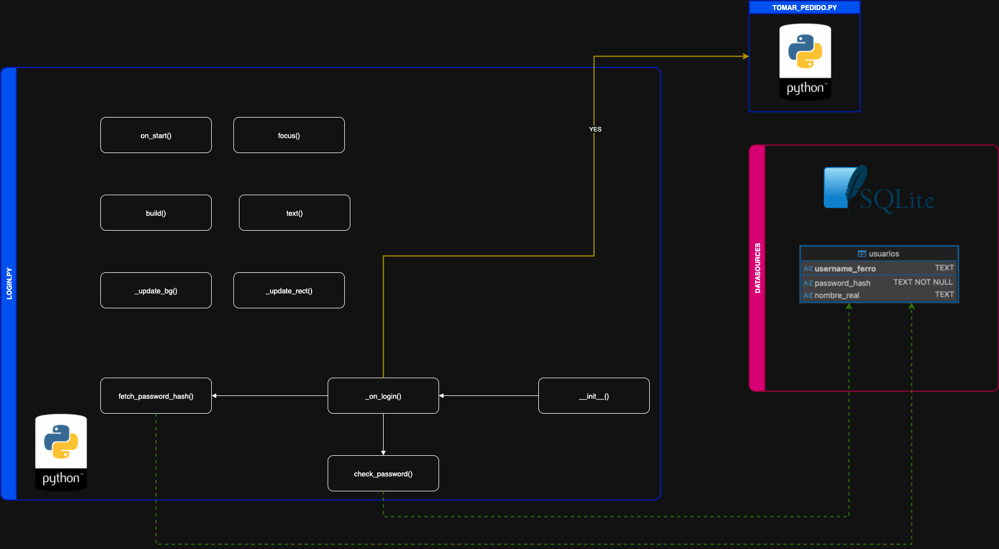
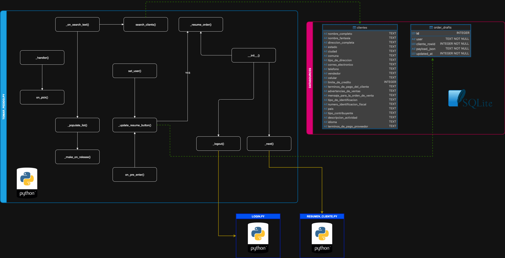
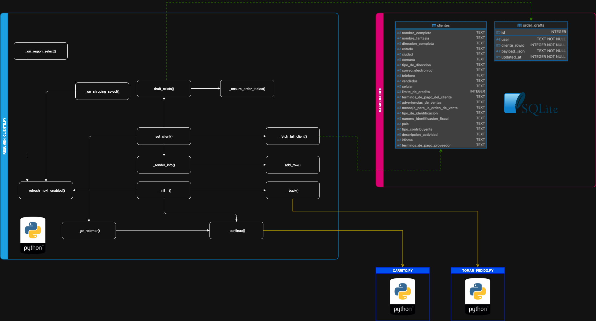
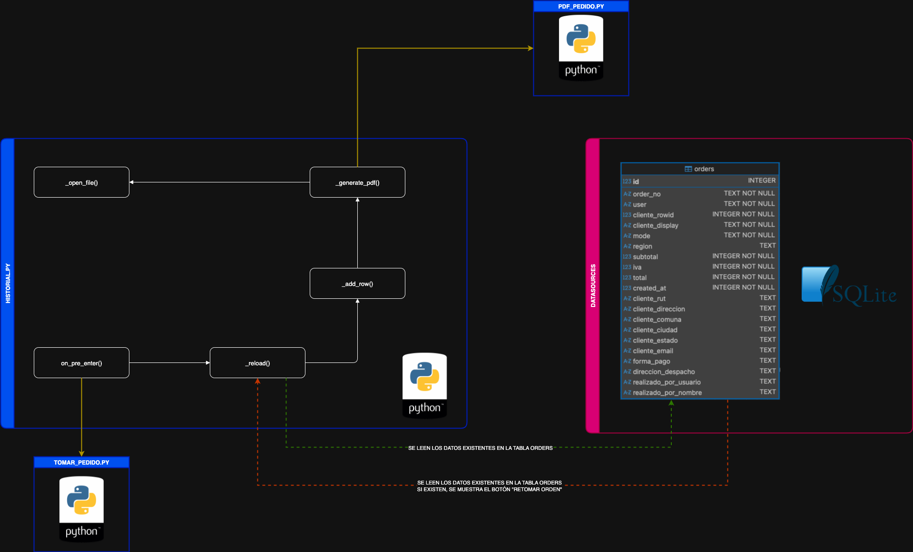
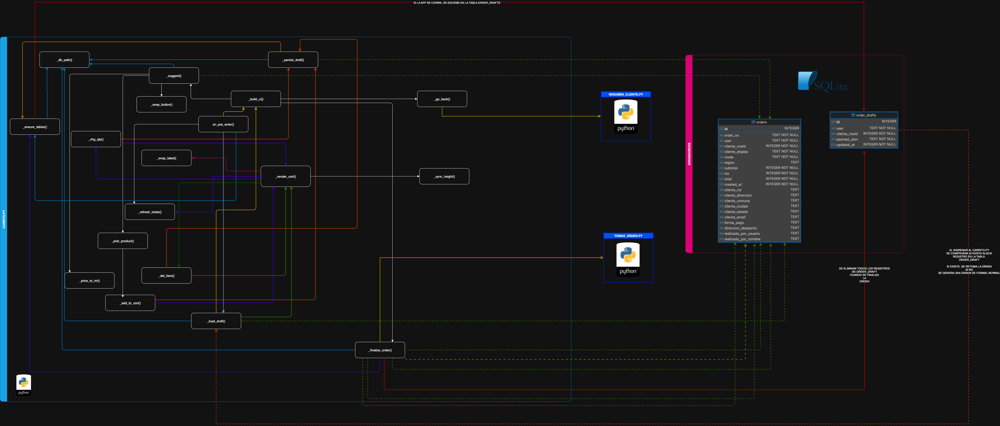
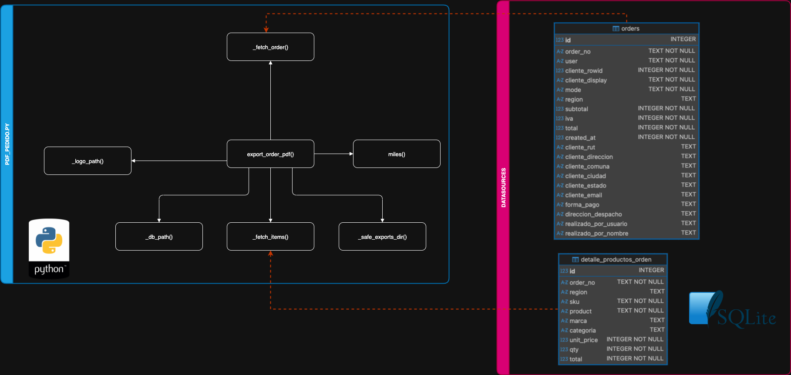

# 📊 Diagramas de Flujo – TODOFERRETERO

Este documento, contiene diagramas que representan un grafo (generado en **ddraw.io** y exportado a .PNG) de dependencias de cada uno de los módulos analizados. Cada nodo corresponde a una función o método definido en el código fuente y se organiza dentro de un swimlane por módulo.

El contenido se presenta en este orden:

-Link al archivo draw.io
-Se muestra el .png exportado desde el archivo draw.io

    Simbología de los flujos:

    - Las aristas sólidas indican invocaciones internas dentro del mismo módulo
    - Las aristas punteadas amarillas, señalan llamadas entre diferentes módulos .py
    - Las aristas punteadas verdes, señalan lecturas a la Base de datos
    - Las aristas punteadas rojas, señalan escrituras a la Base de datos

Además, se incluyen las fuentes de datos detectadas (como bases de datos SQLite) y las operaciones SQL relevantes (SELECT, INSERT, UPDATE, DELETE).

También se identifican eventos de interfaz (ej. on_release, bind en Kivy) que actúan como disparadores entre componentes. De esta manera, el diagrama proporciona una visión general de cómo las funciones del módulo interactúan entre sí, con otros archivos .py y con las fuentes de datos externas.

Los archivos ".py" contenidos en este segmento de la documentación, son:

    - login.py
    - tomar_pedido.py
    - resumen_cliente.py
    - carrito.py
    - historial.py
    - pdf_pedido.py

---

## 🔑 Login - (login.py)

***Descripción:***
Este diagrama muestra el flujo de autenticación implementado en el módulo login (login.py).

Las aristas sólidas representan la lógica interna del módulo, incluyendo la inicialización de la interfaz y la verificación de campos, mientras que las aristas punteadas en color amarillo, señalan las llamadas a otros módulos, como la transición hacia tomar_pedido cuando el inicio de sesión es exitoso.

El grafo también refleja las consultas SQL sobre todoferre.db (particularmente operaciones SELECT), que permiten confirmar la existencia del usuario y validar su acceso.

Además, se destacan los eventos de interfaz (on_release, bind) vinculados a botones como “Ingresar” o “Volver”, que actúan como disparadores de la lógica de autenticación.

En conjunto, este flujo evidencia cómo login conecta la interfaz de usuario, la validación de credenciales y la navegación inicial dentro de la aplicación.

***Los casos de uso considerados en esta pantalla, son:***

    1. La carga de la pantalla de acceso
    2. La captura de credenciales del usuario
    3. La validación contra la base de datos.
    4. si la contraseña es inválida, se impide el acceso
    5. Si existe una orden sin finalizar, al pasar exitosamente el login,
       se debe poder ver la opción de "Retomar Orden"

[📂 Ver documento  >  "flow_login.drawio"](flow_login.drawio)  

  

---

## 📦 Tomar Pedido - (tomar_pedido.py)

***Descripción:***
Este diagrama describe el flujo de toma de pedido del módulo tomar_pedido. Los nodos representan sus métodos y handlers de interfaz (p. ej., inicialización de pantalla, capturas de entrada y validaciones), mientras que las aristas sólidas muestran la secuencia interna entre pasos como preparar el formulario, validar campos y construir el objeto de pedido.

Las aristas punteadas reflejan las invocaciones hacia otros módulos (por ejemplo, actualización/consulta en carrito o traspaso del contexto a resumen_cliente), y los enlaces de eventos de UI (on_release, bind) actúan como disparadores entre componentes.

Cuando corresponde, el grafo incluye la fuente de datos SQLite y las operaciones SQL relevantes (p. ej., SELECT para productos o clientes y INSERT/UPDATE para persistir el pedido), evidenciando la integración entre la lógica de la pantalla y la capa de datos.

En conjunto, el diagrama ofrece una vista compacta de cómo tomar_pedido orquesta la captura, validación y envío del pedido, y cómo colabora con módulos vecinos para completar el proceso.

***Los casos de uso considerados en esta pantalla, son:***

    - Si previamente, se la app se cerró, sin finalizar el pedido, se guarda un registro en la tabla order_drafts, 
      si al ingresar a este módulo, ese registro existe, se habilita un botón que permite ***“Retomar la orden”***

    - Si no existe un registro en la tabla “order_drafts”, el botón no se habilita

    - Si el botón está habilitado, el usuario puede hacer clic en el botón y pasa directamente a retomar 
      el pedido anterior, que se guardó en la tabla ***“order_drafts”***

    - El usuario puede buscar a su cliente usando los siguientes criterios, “nombre de fantasía”
      “nombre real” y “rut”, esos datos los busca en la tabla ***“clientes”***

    - A medida que se van ingresando datos, se despliegan sugerencias que coincidan con la búsqueda realizada por 
      el cliente

    - Se despliega un botón que permite ir a módulo llamado **“historial.py”**

    - Se despliega un botón que permite cerrar la sesión y salir de la aplicación

[📂 Ver documento  >  "flow_tomar_pedido.drawio"](flow_tomar_pedido.drawio)  

  

---

## 👤 Resumen Cliente - (resumen_cliente.py)

***Descripción:***
Este diagrama representa el flujo de selección y confirmación de cliente en el módulo resumen_cliente.
Los nodos corresponden a las funciones responsables de cargar los registros desde la base de datos, mostrar la información en pantalla y habilitar la interacción del usuario mediante botones y eventos (on_release, bind).

Las aristas sólidas reflejan la lógica interna del módulo, como la preparación de la vista y la actualización de datos, mientras que las aristas punteadas señalan las llamadas hacia otros módulos, en especial la transición hacia tomar_pedido una vez seleccionado el cliente.

El diagrama también incorpora las consultas SQL sobre todoferre.db, destacando operaciones SELECT sobre la tabla de clientes, lo que evidencia la dependencia del módulo con la fuente de datos.

En conjunto, este flujo muestra cómo resumen_cliente actúa como puente entre la selección del cliente y la continuación del proceso de pedido, coordinando interfaz, datos y navegación hacia los siguientes pasos de la aplicación.

***Los casos de uso considerados en esta pantalla, son:***

    -Se despliegan en pantalla los datos de cliente seleccionado previamente en la pantalla “tomar_pedido.py”
    -Los datos desplegados, según el requerimiento del cliente son:

        - "RUT”, obtenido de "numero_identificacion_fiscal"
        - "Dirección", obtenido de "direccion_completa"
        - "Tipo de Pago", obtenido de  "terminos_de_pago_del_cliente"
        - "Comuna" , obtenido de "comuna"
        - "Ciudad", obtenido de "ciudad"
        - "Región", obtenido de "estado"
        - "Vendedor", obtenido de "vendedor"
        - “Email" , obtenido de "correo_electronico"

    - Si el usuario nota que el cliente que escogió, no es el correcto, tiene un botón que le permite regresar a 
    la pantalla anterior, en donde hacer una nueva búsqueda de cliente
    
    - El usuario no puede continuar a la siguiente pantalla, si no escoge una opción para despacho
  
    - Si los datos del cliente no consideran una región, se despliega una opción obligatoria para 
    ingresar esta información, este dato, es esencial, puesto que en la siguiente pantalla, donde se ingresan 
    los productos, la lista de precios no es la misma para cada región del país (se puede dar el caso 
    que un SKU tenga el mismo precio en Valparaíso y Santiago, sin embargo, ese dato no es relevante para la 
    lógica, debe siempre haber una región seleccionada en los datos del cliente)

    - Si el cliente no tiene una región seleccionada y escoge la opción “retiro”, puede seguir a 
    la siguiente pantalla, pues el requerimiento fue que los precios que se mostrarán en la siguiente pantalla, 
    son los de la región metropolitana

    - Si el usuario escoge la opción “despacho” y en los datos del cliente hay datos en la columna de “estado”, 
    el usuario puede seguir a la siguiente pantalla

    - Se despliega un cuadro de “Notas:”, en donde el usuario ingresa texto

[📂 Ver documento  >  "flow_resumen_cliente.drawio"](low_resumen_cliente.drawio)  

  

---

## 📜 Historial - (historial.py)

***Descripción:***
Este diagrama representa el flujo de consulta y gestión del historial de pedidos en el módulo historial.

Los nodos corresponden a las funciones que se ejecutan al cargar la pantalla, recuperar los registros desde la base de datos y poblar la interfaz con los pedidos previos. Las aristas sólidas muestran la secuencia interna entre métodos como on_pre_enter() y _reload(), encargados de preparar y actualizar la vista, mientras que las aristas punteadas reflejan la interacción con otros módulos, en especial la invocación a pdf_pedido para la generación de comprobantes en PDF.

El diagrama también incorpora las operaciones SQL sobre todoferre.db, principalmente consultas SELECT a la tabla de pedidos (orders), que permiten mostrar la información histórica al usuario. Asimismo, se incluyen los eventos de interfaz (botones como “Generar PDF” y “Volver”) que actúan como disparadores de las acciones disponibles en la pantalla. En conjunto, este flujo muestra cómo historial integra interfaz, persistencia de datos y salida documental, ofreciendo al usuario una vista completa de pedidos previos con opciones de exportación.

***Los casos de uso considerados en esta pantalla, son:***

    - Se despliegan en pantalla los registros guardados en la tabla "orders"
    - Si se generan nuevos registros después de completar una orden, deben desplegarse inmediatamente en esta pantalla
    - Si la orden no se comppleta, no deben aparecer registros desde la tabla "orders"
    - Cada uno de los registros históricos, debe tener un botón asociado para "Generar PDF"
    - Cada registro historico desplegados, debe contener:
         "número de serie de la orden"
         "Nombre del cliente"
         "monto de la compra" 
         "fecha y hora"
    - Debe existir un botón que permita regresar a la pantalla previa (tomar_orden.py)

[📂 Ver documento  >  draw.io](flow_historial.drawio)  
  

---

## 🛒 Carrito - (carrito.py)

***Descripción:***
Este diagrama detalla el flujo de armado y mantenimiento del carrito en el módulo carrito.

Los nodos representan funciones que inicializan la vista, hidratan el carrito (desde memoria o consulta previa), y gestionan líneas de pedido:

        -Agregar ítems
        -Actualizar cantidades (incremento/decremento)
        -Eliminar productos
        -Vaciar

Las aristas sólidas reflejan la secuencia interna habitual:

        -evento de UI (on_release en botones como “+”, “−”)
        -“Eliminar”
        -“Vaciar”
        -“Siguiente”
        -validaciones (producto válido, cantidad > 0, disponibilidad/stock)
        -mutación del carrito
        -re-cálculo de totales (subtotal, descuentos, impuestos si aplica)
        -refresco de la interfaz y,
        -cuando corresponde, persistencia.

Las aristas punteadas indican llamadas entre módulos, por ejemplo:

        -hacia resumen_cliente para continuar el proceso con los datos seleccionados
        -hacia tomar_pedido en flujos de ida/vuelta
        -o hacia pdf_pedido cuando se emite una cotización/boleta directa desde el carrito

El grafo incorpora la interacción con todoferre.db, con operaciones:

        -SELECT para obtener precio/stock de productos
        -INSERT/UPDATE en la tabla de líneas de pedido (p. ej., order_items) al agregar/modificar cantidades
        -DELETE al eliminar ítems y, en la confirmación
        -INSERT del encabezado en orders.

En conjunto, el diagrama muestra cómo carrito orquesta eventos de interfaz, reglas de negocio y acceso a datos, garantizando que cada acción del usuario se traduzca en un estado de carrito coherente, totales recalculados y una transición limpia hacia los siguientes pasos del proceso de venta.

***Los casos de uso considerados en esta pantalla, son:***

    - Se deben desplegar la información de región (influye en la lista de precios)
    - Se debe desplegar el nombre del cliente (se trae de "resumen_cliente.py)
    - Se debe desplegar un cuadro de busqueda dinámica
    - Se puede hacer una busqueda por sku o nombre de productoi
    - Los resultados de busqueda son dinámicos en el despliegue
    - Al desplegarse los resultados, a estos se les puede hacer clic
    - Al hacer clic en el resultado, este se agrega automaticamente al carrito
    - Cuando el producto está en el carrito, se puede sumar, restar o eliminar
    - Si se hace clic varias veces en el resultado de busqueda, se agregan productos = clic
    - Cuando se agregan productos, las cantidades de "Subtotal" cambian
    - Cuando se agregan productos, las cantidades de "Total" cambian
    - La cantidad "Total" está sujeta a IVA (19%)
    - Mientras se está haciendo la orden, se escribe un registro en la tabla "order_drafts"
    - Si se cierra la app, los datos de "order_drafts", retoman la sesión
    - Una vez que se presiona "Finalizar Orden", se borran los datos de "order_drafts"
    - Una vez que se presiona "Finalizar Orden", se redirige al usuario a la pantalla para buscar cliente
    - El finalizar la orden, se genera un numero de orden que se compone de (nombre de usuario + num ramdom(5))
    - Al finalizar la orden, debe quedar un registro que se vea en "Historial" (se escribe en tabla "orders")
    - Se debe desplegar un boton "Volver"
    - El botón "Volver", lleva al usuario a la pantalla "Resumen Cliente"

[📂 Ver documento > flow_carrito.drawio](flow_carrito.drawio)  
  

---

## 📝 PDF Pedido - (pdf_pedido.py)

***Descripción:***
Este diagrama describe el flujo de generación de documentos PDF en el módulo pdf_pedido.

Los nodos representan las funciones que se encargan de recibir los datos del pedido, estructurar la información y renderizarla en formato PDF.

Las aristas sólidas muestran la secuencia lógica dentro del módulo, desde la preparación de contenido hasta la escritura del archivo en disco, mientras que las aristas punteadas indican las llamadas provenientes de otros módulos, como historial o tomar_pedido, que invocan la funcionalidad para producir el comprobante del pedido.

El diagrama también resalta la interacción con la fuente de datos SQLite, utilizada para obtener la información del pedido antes de la exportación, y la presencia de eventos que actúan como disparadores (por ejemplo, botones de interfaz que inician la exportación).

En conjunto, este flujo deja en evidencia cómo pdf_pedido funciona como un módulo especializado en la salida documental, sirviendo de punto final para transformar los registros del sistema en un archivo legible y transportable.

***Los casos de uso considerados en esta pantalla, son:***

    - Generar PDF no es una página, es una funcionalidad que se muestra como botón
    - El botón de "Imprimir PDF", se muestra en la pagina de "Historial"
    - En Android, al generar el PDF, se abre con la app para PDF. que funcione en el dispositivo
    - Se usa una app random, ya que se evita que el usuario deba buscar donde queda el PDF al ser generado
    - Para la primera compilación para Android, se deshabilitó la generación del PDF
    - Los datos de la generación de PDF se leen desde "orders"
    - El PDF que se genera, tiene el logo "todoferretero" en el costado superior izquierdo
    - El PDF tiene el titulo de "Pedido" en el costado superior derecho
    - El PDF tiene la fecha y hora de cuando fue generado el pedido
    - El PDF tiene un numero de orden que se genera aleatoreamente usando el nombre del usuario y un numero random
    - El PDF informa quien realizó la orden tras el texto "Realizado por:"
    - El PDF incluye texto "Señor(es):" nombre del cliente 
    - El PDF incluye "Dirección:", dirección cliente tabla "orders"
    - El PDF incluye "Forma de Pago:", forma de pago tabla "orders"
    - El PDF incluye "Dirección de Despacho:", dirección de tabla "orders"
    - EL PDF muestra la info de "Lista de Precios:", "region" desde tabla "orders"
    - El PDF muestra "RUT:", de la tabla "orders"
    - El PDF muestra "Comuna:", despliega la comuna desde la tabla "orders"
    - El PDF muestra "Ciudad", despliega la info de la tabla "orders"
    - El PDF muestra "Email:", despliega la imfo de la tabla "orders"

[📂 Ver documento > flow_pdf_pedido.drawio](flow_pdf_pedido.drawio)  
  

---
